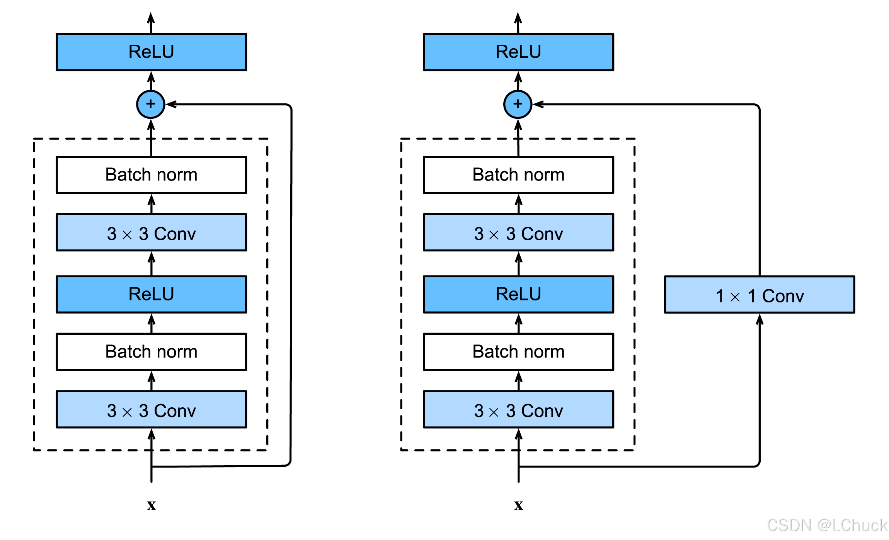

# 实验报告

2025机器学习基础课程大作业 任务二 医学图像检测实验报告

## 一、任务描述

利用彩色眼底图像判断是否患病

## 二、实验模型原理和概述

ResNet（残差网络）是深度学习领域的一项重大突破，它巧妙解决了深层神经网络训练中的梯度消失/爆炸问题，使得构建和训练更深的网络成为可能。作为计算机视觉领域的里程碑模型，ResNet在2015年的ImageNet竞赛中以超过152层的深度刷新了当时的记录，并一举夺得冠军。

### ResNet的核心思想

在ResNet出现之前，研究人员发现随着网络层数的增加，网络性能不升反降。这一现象被称为"退化问题"(degradation problem)，有趣的是，这并非由过拟合引起，而是由于深层网络难以优化：随着网络深度增加，梯度在反向传播过程中可能会消失或爆炸，导致网络难以收敛。何恺明等人在论文中通过对比实验清晰地展示了这一问题：56层网络的训练误差和测试误差反而比20层网络更高。

ResNet的核心创新是引入了**残差学习**框架。其基本思想是：不直接学习从输入到输出的映射关系 H(x)，而是学习残差映射 F(x) = H(x) - x。这样，原始的前向路径可以表示为
$$
H(x) = F(x)+x
$$
这种结构被称为**跳跃连接**(skip connection)或**捷径连接**(shortcut connection)，它允许梯度在反向传播时直接流过这些连接，有效缓解了梯度消失问题。从直觉上理解，学习残差比学习完整的映射更容易，特别是当最优映射接近于恒等映射时。

从数学角度看，残差连接使得网络在反向传播时的梯度计算变为：
$$
∂L/∂x = ∂L/∂H · (∂F/∂x + 1)
$$
这保证了即使$∂F/∂x$很小，梯度仍然可以通过"1"这一项传回前面的层，避免了梯度消失问题。



## 三、实验模型结构与参数

### ResNet50网络结构


ResNet50是ResNet系列中的一个变种，包含50个卷积层。其整体架构可分为三部分：

1. **头部(Head)**：初始特征提取
2. **主体(Body)**：多个残差块堆叠
3. **尾部(Tail)**：分类器

## 四、实验结果分析

训练集由 disease 和 normal 两个部分组成，训练集包含 646 张 disease 图像（对应label-1）与 993 张normal 图像，总体而言数据集内容较少。测试集由150张normal与100张disease组成。

### 第一次实验结果

|              | precision | recall | f1-score | support |
| :----------: | :-------: | :----: | :------: | :-----: |
|    normal    |   0.60    |  0.96  |   0.74   |   150   |
|   disease    |   0.96    |  0.57  |   0.72   |   100   |
|   accuracy   |     \     |   \    |   0.73   |   250   |
|  macro avg   |   0.78    |  0.77  |   0.73   |   250   |
| weighted avg |   0.81    |  0.73  |   0.73   |   250   |

从第一次实验结果来看，假阴性的概率很高，在医疗图像检测中假阴性的危害远大于假阳性。
$$
Recall = \frac{TP}{TP+FN}
$$
从**Recall数据**来看，对normal：

recall = 0.96    =>    96%的正常图片都被识别出来了，几乎没有漏诊的正常图像 。

对disease:

recall = 0.57     =>   仅57%的病变图像被识别出来，说明真阳性的漏诊严重。与随机的0.5结果相近，说明疾病漏诊严重，这是在医学任务中是非常危险的，该模型的预测结果是不可接受的。

**参考整体指标的Accuracy(准确率)**

整体的正确率为0.73，可靠性不高。且在医学任务中的准确率数据参考意义相对较小。

### 对第一次实验进行改进

考虑到样本数量不多，训练集normal与disease的样例数差别在可接受的范围以内，而对于医疗图像的病灶位置并不明晰，遂放弃使用数据增强的方法。

于是本实验选取了**Focal Loss**的方法，加强对disease特征判断的训练

```python
class FocalLoss(torch.nn.Module):
    def __init__(self, alpha=1.5, gamma=2):
        super(FocalLoss, self).__init__()
        self.alpha = alpha
        self.gamma = gamma
	
    # 更新前向传播
    def forward(self, inputs, targets):
        ce = F.cross_entropy(inputs, targets, reduction='none')
        pt = torch.exp(-ce)  # pt 越小表示越难样本
        focal_loss = self.alpha * (1 - pt) ** self.gamma * ce
        return focal_loss.mean()
```

Focal loss基于二分类交叉熵。它是一个动态缩放的交叉熵损失，通过一个动态缩放因子，可以动态降低训练过程中易区分样本的权重，从而将重心快速聚焦在那些难区分的样本（有可能是正样本，也有可能是负样本，但都是对训练网络有帮助的样本）

```python
criterion = FocalLoss(alpha=2.0, gamma=2).to(device)
```

此次实验得到模型预测效果：

|              | precision | recall | f1-score | support |
| :----------: | :-------: | :----: | :------: | :-----: |
|    normal    |   0.95    |  0.55  |   0.69   |   150   |
|   disease    |   0.59    |  0.96  |   0.73   |   100   |
|   accuracy   |     \     |   \    |   0.71   |   250   |
|  macro avg   |   0.77    |  0.75  |   0.71   |   250   |
| weighted avg |   0.81    |  0.71  |   0.71   |   250   |

通过调整后，尽管准确率略有下降（0.73 -> 0.71），但分类器对disease标签的判断正确率高了很多，96%的病例都被正确地识别出来：


100例disease中仅存在4例被漏诊的情况，较第一次实验已有不错的改善。

### 改进后结果分析

下图为训练过程中的收敛曲线：


在4-8轮 epoch 中，Loss出现了一定的上升。后又下降恢复，推测与数据集本身较小且分布略有不均有关。

接下来为ROC曲线的绘制，判断阈值的控制与移动由softmax实现：

```python
probs = F.softmax(outputs, dim=1)[:, 1]
```

得到曲线图像如下：


AUC结果为0.8878，和理想最佳结果1.0较为接近，可以接受。

## 总结

测试集与训练集均为分辨率1k+的图像，训练前对其进行了压缩与标准化处理。

训练集本身较小，但由于对病灶特征与分布情况不了解，难以开展数据的增强处理工作；如若可以预先对数据进行处理，分类器的性能仍有进一步上升空间。

在医学图像检测领域，假阴性的危害是远大于假阳性的。根据贝叶斯概率公式，假阳性的弊端可以通过多次复查的方式有效回避，而高概率的假阴性则几乎会让分类器完全失效，严重耽误患者及时就医，严重增加医院方病患排查成本。

另外，在本次实验初期，由于disease和normal的字母序为disease在前，一度出现过标签错误的实验情况，已从中汲取教训并及时修正早期错误实验结果。

```
created by BY2517005 黎子玮
```

